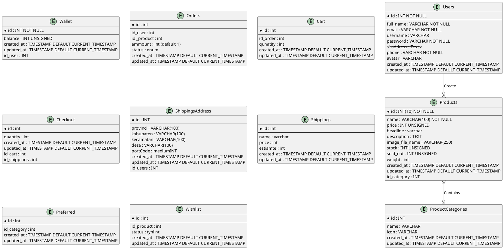

```plantuml
@startuml

entity Users {
    * id : INT NOT NULL
    --
    full_name : VARCHAR NOT NULL
    email : VARCHAR NOT NULL
    username : VARCHAR
    password : VARCHAR NOT NULL
    <!-- address : Text -->
    phone : VARCHAR NOT NULL
    avatar : VARCHAR
    created_at : TIMESTAMP DEFAULT CURRENT_TIMESTAMP
    updated_at : TIMESTAMP DEFAULT CURRENT_TIMESTAMP
}

entity Wallet {
    * id : INT NOT NULL
    --
    balance : INT UNSIGNED
    created_at : TIMESTAMP DEFAULT CURRENT_TIMESTAMP
    updated_at : TIMESTAMP DEFAULT CURRENT_TIMESTAMP
    id_user : INT
}

entity Products {
    * id : INT(10) NOT NULL
    --
    name : VARCHAR(100) NOT NULL
    price : INT UNSIGNED
    headline : varchar
    description : TEXT
    image_file_name : VARCHAR(250)
    stock : INT UNSIGNED
    sold_out : INT UNSIGNED
    weight : int
    created_at : TIMESTAMP DEFAULT CURRENT_TIMESTAMP
    updated_at : TIMESTAMP DEFAULT CURRENT_TIMESTAMP
    id_category : INT
}

entity Orders {
    * id : int
    --
    id_user : int
    id _product : int
    ammount : int (default 1)
    status : enum
    created_at : TIMESTAMP DEFAULT CURRENT_TIMESTAMP
    updated_at : TIMESTAMP DEFAULT CURRENT_TIMESTAMP
}

entity Cart {
    * id : int
    --
    id_order : int
    qunatity : int
    created_at : TIMESTAMP DEFAULT CURRENT_TIMESTAMP
    updated_at : TIMESTAMP DEFAULT CURRENT_TIMESTAMP
}

entity Checkout {
    * id : int
    --
    quantity : int
    created_at : TIMESTAMP DEFAULT CURRENT_TIMESTAMP
    updated_at : TIMESTAMP DEFAULT CURRENT_TIMESTAMP
    id_cart : int
    id_shippings : int
}

entity ShippingsAddress {
    * id : INT
    --
    provinci : VARCHAR(100)
    kabupaten : VARCHAR(100)
    kecamatan : VARCHAR(100)
    desa : VARCHAR(100)
    portCode : mediumINT 
    created_at : TIMESTAMP DEFAULT CURRENT_TIMESTAMP
    updated_at : TIMESTAMP DEFAULT CURRENT_TIMESTAMP
    id_users : INT
}

entity Shippings {
    * id : int
    --
    name : varchar
    price : int
    estiamte : int
    created_at : TIMESTAMP DEFAULT CURRENT_TIMESTAMP
    updated_at : TIMESTAMP DEFAULT CURRENT_TIMESTAMP
}

entity ProductCategories {
    * id : INT
    --
    name : VARCHAR
    icon : VARCHAR
    created_at : TIMESTAMP DEFAULT CURRENT_TIMESTAMP
    updated_at : TIMESTAMP DEFAULT CURRENT_TIMESTAMP
}

entity Preferred {
    * id : int
    --
    id_category : int
    created_at : TIMESTAMP DEFAULT CURRENT_TIMESTAMP
    updated_at : TIMESTAMP DEFAULT CURRENT_TIMESTAMP
}

entity Wishlist {
    * id : int
    --
    id_product : int
    status : tyniint
    created_at : TIMESTAMP DEFAULT CURRENT_TIMESTAMP
    updated_at : TIMESTAMP DEFAULT CURRENT_TIMESTAMP
}

Users ||--o{ Products : Create
Products }|--o| ProductCategories : Contains


@enduml
```